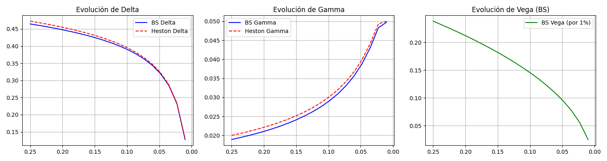

# Dynamic Option Valuation and Risk Management
🚀 **Live Web App:** [Interactive Dashboard]([https://blackscholevsheston-option-valuation.streamlit.app/])

## 1. Problem Statement
This project focuses on the valuation and risk management of a portfolio consisting of **European Call Options** on a highly volatile technology stock. 

Traditional models like Black-Scholes assume constant volatility, which fails to capture real-world market dynamics such as **volatility clustering** and **mean reversion**. This repository implements an interactive comparison between the classic model and the **Heston Stochastic Volatility Model** to address significant "Vega" risks—losses incurred due to unexpected changes in volatility.

## 2. Theoretical Framework

### Stochastic Volatility Modeling
The system is governed by coupled stochastic processes. While the stock price follows a Geometric Brownian Motion, the volatility itself follows a **mean-reverting Ornstein-Uhlenbeck process**.

### Key Concepts Implemented:
* **Heston Model:** Incorporates stochastic variance to capture the "volatility smile".
* **Mean Reversion ($\kappa$):** The speed at which volatility returns to its long-term average.
* **Vega Hedging:** Management of portfolio sensitivity to changes in the underlying asset's volatility.
* **Tracking Error:** Analysis of the hedging effectiveness considering transaction costs ($c = 0.15\%$).

## 3. System Parameters
The simulation and valuation in the interactive app are initialized with the following market data:

| Parameter | Symbol | Value |
| :--- | :--- | :--- |
| Initial Stock Price | $S_0$ | \$120 |
| Strike Price | $K$ | \$125 |
| Time to Maturity | $T$ | 90 Days (0.25 years) |
| Risk-free Rate | $r$ | 4% annual |
| Initial Volatility | $\sigma_0$ | 35% annual |
| Mean Reversion Speed | $\kappa$ | 2.5 |
| Long-term Volatility | $\overline{\sigma}$ | 30% annual |
| Volatility of Volatility | $v$ | 0.15 |

## 4. Analysis and Results

### Comparison of Models (Part A)

Quantitative analysis of the valuation gap between Black-Scholes and Heston. It includes the evolution of the "Greeks" (Delta, Gamma, Vega) over time, which can be visualized dynamically in the web app.

### Hedging Optimization (Part B)
Evaluation of the optimal **Delta-Hedging** frequency to minimize the tracking error while balancing transaction costs.

### Sensitivity Analysis (Part C)
Stress testing the portfolio against:
* **Volatility Shocks:** 50% increase in volatility (crisis events).
* **Parametric Uncertainty:** $\pm20\%$ error in mean reversion estimates.
* **Transaction Costs:** Impact of cost increases (up to 0.5%) on rebalancing frequency.

## 5. Requirements and Local Execution
To run this interactive dashboard locally, ensure you have Python 3.x installed along with the following libraries:
* `streamlit`
* `numpy`
* `scipy`
* `matplotlib`

**Steps to run:**
1. Clone the repository.
2. Install dependencies: `pip install -r requirements.txt`
3. Execute the Streamlit app:
   ```bash
   streamlit run app.py
